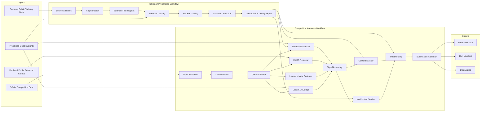

# Architecture

## 1. Architecture Style
The project is a **batch machine-learning inference pipeline** with:
- offline data/model assets;
- multiple independent prediction signals;
- regime-specific stacking;
- strict competition-output validation.

The target deployment is a Kaggle notebook, but the logical architecture should remain modular.

## 2. Logical Architecture



## 3. Recommended Repository Structure

```text
bengali-hallucination-detection/
├── README.md
├── prd.md
├── rules.md
├── phases.md
├── design.md
├── architecture.md
├── pyproject.toml
├── requirements.txt
│
├── configs/
│   ├── dev.yaml
│   ├── train.yaml
│   └── competition_inference.yaml
│
├── data/                       # official competition data; read-only
├── dev_data/                   # official development data; read-only
├── external_data/              # declared public external datasets
├── processed_data/             # generated, reproducible derivatives
├── features/                   # cached feature artifacts
├── models/                     # local checkpoints for development
├── submissions/
├── artifacts/
│
├── src/
│   └── halludetect/
│       ├── __init__.py
│       ├── config.py
│       ├── schemas.py
│       ├── logging_utils.py
│       │
│       ├── data/
│       │   ├── competition.py
│       │   ├── external.py
│       │   ├── augmentation.py
│       │   └── provenance.py
│       │
│       ├── text/
│       │   ├── normalize.py
│       │   └── lexical.py
│       │
│       ├── models/
│       │   ├── encoder.py
│       │   ├── llm_judge.py
│       │   └── checkpoints.py
│       │
│       ├── retrieval/
│       │   ├── corpus.py
│       │   ├── index.py
│       │   └── retrieve.py
│       │
│       ├── features/
│       │   ├── metadata.py
│       │   └── signals.py
│       │
│       ├── stacking/
│       │   ├── lightgbm_stacker.py
│       │   └── thresholds.py
│       │
│       ├── evaluation/
│       │   ├── metrics.py
│       │   ├── slices.py
│       │   └── errors.py
│       │
│       └── pipeline/
│           ├── train.py
│           └── infer.py
│
├── notebooks/
│   ├── 01_eda.ipynb
│   ├── 02_train_encoders.ipynb
│   ├── 03_train_stacker.ipynb
│   └── 04_competition_inference.ipynb
│
├── tests/
│   ├── test_data_contract.py
│   ├── test_label_semantics.py
│   ├── test_no_context.py
│   ├── test_submission.py
│   └── test_no_test_leakage.py
│
└── docs/
    ├── data_registry.md
    ├── experiments.md
    └── reproducibility.md
```

## 4. Runtime Architecture

### Stage A — Bootstrap
- install/pin dependencies;
- load configuration;
- set seeds;
- inspect GPU/CPU environment.

### Stage B — Load
- load official data;
- load checkpoints;
- load retrieval corpus/index;
- validate all required assets.

### Stage C — Feature generation
For each row:
- normalize;
- detect context regime;
- run encoder(s);
- run retrieval for no-context rows;
- compute lexical/meta features;
- run local LLM judge.

### Stage D — Decision
- assemble signal matrix;
- apply regime-specific stacker;
- apply frozen regime threshold;
- emit label.

### Stage E — Validate and export
- verify row count dynamically;
- verify IDs;
- verify binary integer labels;
- save `submission.csv`;
- save run manifest.

## 5. Data Contracts

### Prediction signal table
Recommended columns:

```text
id
no_ctx
enc
lex
retr
llm
prompt_len
ctx_len
resp_len
tfidf_sim
retr_sim
```

Missing values are allowed only when a feature is structurally unavailable. The stacker must be trained with the same missingness semantics used at inference.

### Run manifest
Recommended fields:
```json
{
  "seed": 42,
  "config_hash": "...",
  "models": {},
  "datasets": {},
  "thresholds": {},
  "runtime_seconds": 0,
  "hardware": {},
  "submission_rows": 0
}
```

## 6. Dependency Boundaries
- `data` must not import model code.
- `models` must not mutate datasets.
- `retrieval` returns evidence/scores, not final labels.
- `features` must be deterministic from its inputs.
- `stacking` consumes a stable feature schema.
- `pipeline/infer.py` orchestrates components but should contain minimal business logic.

## 7. Training vs Inference Boundary

### Training workflow may
- construct permitted augmented datasets;
- train encoders;
- fit stackers;
- tune thresholds on labeled validation data;
- export checkpoints/configuration.

### Competition inference workflow may only
- load frozen artifacts;
- read official test inputs;
- compute features/predictions;
- write outputs.

It must not:
- train on test rows;
- create pseudo-label feedback loops;
- modify model weights based on test predictions;
- use hidden/manual test annotations.

## 8. Failure and Fallback Architecture

### Hard failure
Stop the run when:
- required official data is missing;
- checkpoint is missing;
- schema is invalid;
- model output length differs from input;
- submission validation fails.

### Controlled fallback
Allowed only when predeclared and reproducible:
- TigerLLM → smaller local open-weight judge;
- FAISS GPU → FAISS CPU.

Fallback usage must be logged because it can change predictions.

## 9. Performance Architecture
Primary cost centers:
1. encoder inference;
2. retrieval embeddings/search;
3. LLM judge;
4. optional training.

Optimization order:
- pretrain and attach checkpoints;
- avoid training in final inference;
- batch model inference;
- use mixed precision where numerically safe;
- bound sequence length;
- prebuild reusable retrieval artifacts if rules permit;
- release GPU memory between incompatible large models.

## 10. Architectural Risks
- **Documentation drift:** README currently differs from notebook backbone choices.
- **Test leakage:** current pseudo-label logic is incompatible with the competition-safe architecture.
- **Distribution coupling:** rank normalization across validation and test should be reviewed for held-out rerun robustness.
- **Fallback nondeterminism:** different available GPU memory may select different LLMs.
- **Notebook monolith:** hidden state and cell-order dependencies reduce reproducibility.
- **Hardcoded assumptions:** fixed test length can fail organizer held-out reruns.

## 11. Target End State
The final system should have:
- one frozen training pipeline;
- one clean inference notebook;
- no test-derived training;
- a versioned external-data/model registry;
- dynamic input validation;
- deterministic artifact loading;
- measured runtime and model-size compliance;
- documentation that exactly matches the implementation.
