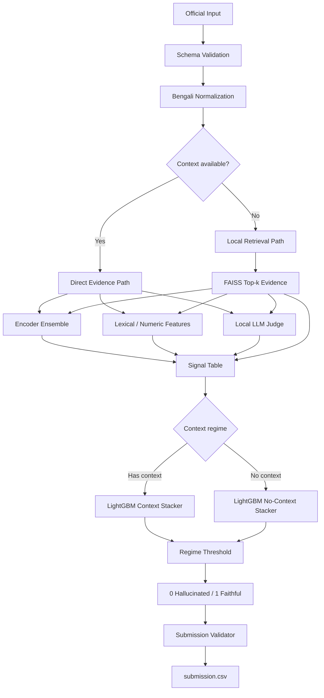

# System Design

## 1. Design Principles
1. **Compliance before score.**
2. **Strong simple baseline before complexity.**
3. **Different evidence paths for context-present and no-context examples.**
4. **Complementary signals rather than redundant model stacking.**
5. **Offline, reproducible inference.**
6. **Training and inference are separate deliverables.**

## 2. Input Contract

### Required semantic fields
- `id` — stable test identifier
- `prompt_bn` — Bengali prompt
- `response_bn` — candidate response
- `context` — optional supporting context
- `label` — available only for labeled development/validation data

### Derived canonical fields
- `no_ctx: bool`
- `ctx_clean: str`
- `premise: str`
- `response: str`

If context exists:
`premise = prompt_bn + context`

If context is missing:
`premise = prompt_bn`

## 3. Processing Flow



## 4. Component Design

### 4.1 Data Loader
Responsibilities:
- load immutable official data;
- validate schemas;
- preserve IDs/order;
- normalize null-context representations;
- reject malformed labels.

The loader must not write into official input directories.

### 4.2 Text Utilities
Deterministic utilities:
- NFC normalization;
- Bengali digit normalization for numeric comparison;
- token extraction;
- content overlap;
- sentence splitting;
- Bengali-content checks.

These utilities are feature helpers, not replacements for model tokenization.

### 4.3 Training Data Builder
Sources are adapters with a common output schema:

| Field | Meaning |
|---|---|
| `premise` | prompt/evidence text |
| `response` | candidate answer |
| `label` | 0 or 1 |
| `mode` | transformation/hallucination type |
| `src` | source dataset |

Synthetic transformations may include:
- faithful QA answer;
- wrong-attribute substitution;
- numeric corruption;
- extrinsic answer substitution;
- NLI entailment/contradiction mapping;
- cloze transformations.

Every transformation must be deterministic under the project seed and auditable.

### 4.4 Encoder Ensemble
Current intended implementation:
- BanglaBERT-Large;
- mDeBERTa-v3-base.

Each encoder:
1. tokenizes `(premise, response)`;
2. produces two-class logits;
3. converts logits to `P(label=1)`;
4. exposes probabilities to the ensemble.

The initial ensemble is an equal-weight mean. More complex weighting requires leakage-safe evidence that it improves validation.

### 4.5 Retrieval
Used only when context is absent.

Pipeline:
1. load declared Bengali public corpus;
2. split into overlapping chunks;
3. embed chunks with multilingual sentence embeddings;
4. index normalized vectors with FAISS inner product;
5. embed the prompt;
6. retrieve top-k passages;
7. score `(prompt + retrieved passage, response)` using the retained encoder;
8. aggregate rank-weighted scores;
9. expose top retrieval similarity.

Design constraints:
- no test-specific corpus;
- no hidden internet retrieval at inference;
- corpus and embedding model must be attached locally.

### 4.6 Lexical and Numeric Features
For context-present examples:
- response-token containment in context;
- numeric consistency.

For both regimes where applicable:
- prompt length;
- context length;
- response length;
- TF-IDF prompt-context similarity;
- retrieval similarity.

### 4.7 Local LLM Judge
The LLM judge is a complementary classifier, not a generator.

Preferred behavior:
- fixed classification prompt;
- single forward pass;
- extract logits/probabilities for class tokens;
- no generated explanation;
- local open-weight model only.

Fallback order may use smaller local models, but all fallback assets must be declared before submission.

### 4.8 Signal Normalization
Model signals may have incompatible calibration. Rank normalization can be performed by regime before stacking.

Caution: normalization references must be designed so organizer reruns on a held-out set remain valid. Avoid any transformation that requires hidden labels or assumes a fixed test distribution.

### 4.9 Meta-Model
Use two small LightGBM models:
- `stacker_has_context`
- `stacker_no_context`

Rationale:
- evidence availability changes feature meaning;
- retrieval features are meaningful mainly in the no-context regime;
- separate models reduce regime interaction complexity.

The stacker must remain deliberately small to reduce overfitting.

### 4.10 Thresholding
Because the metric is F1 on class `0`, `0.5` is not necessarily optimal.

Thresholds:
- are tuned on permitted labeled validation data;
- are separate by context regime if validated;
- are frozen before final test inference.

## 5. Output Design

### `submission.csv`
Exactly:
```text
id,label
```

Validation checks:
- same number of rows as loaded test/sample submission;
- exact columns and order;
- IDs aligned with test;
- labels are integer `0` or `1`;
- no NaN.

### Diagnostic artifacts
Recommended:
- `val_signals.csv`
- `errors.csv`
- `run_manifest.json`
- `metrics.json`

Do not generate pseudo-label files from the competition test set.

## 6. Configuration Design
Centralize:
- paths;
- model IDs;
- feature flags;
- seeds;
- training hyperparameters;
- retrieval parameters;
- runtime limits;
- thresholds.

Use separate profiles:
- `dev`
- `train`
- `competition_inference`

The competition profile must disable training and all test-derived feedback loops.

## 7. Error Handling
Critical failures:
- missing official input;
- schema mismatch;
- missing required checkpoint;
- prediction length mismatch;
- invalid submission.

These must stop execution.

Optional-source failures:
- missing optional public augmentation dataset;
- unavailable non-essential visualization.

These may be skipped with explicit logging.

## 8. Security and Secrets
A Hugging Face token may be used only to obtain permitted assets during preparation where allowed. The final reproducible inference path should prefer attached local assets and must not expose secrets in notebook output.

## 9. Observability
Log:
- configuration;
- dataset counts by source/label;
- model load source;
- GPU memory before/after heavy stages;
- stage runtime;
- validation F1 by regime;
- feature importance;
- final prediction distribution.

## 10. Design Decisions to Freeze
Before final submission, explicitly freeze:
- encoder backbones;
- retrieval corpus and embedding model;
- top-k/chunk parameters;
- LLM judge and fallback list;
- meta-features;
- stacker parameters;
- thresholds;
- attached model/data versions.
